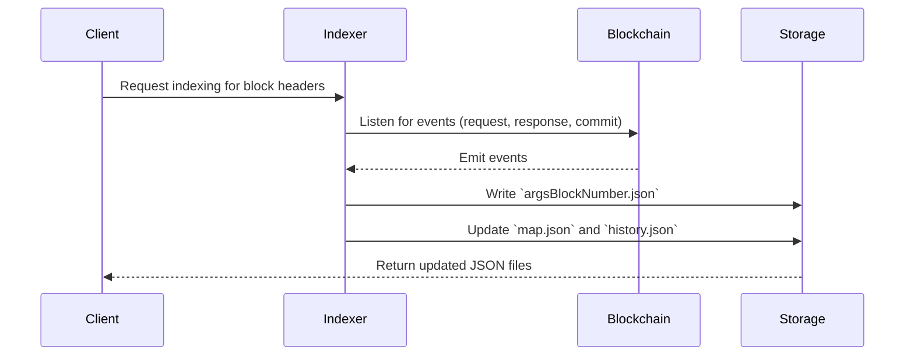

# 🚀 **HeaderProtocol: Event Indexer Service**

<div style="text-align:center" align="center">
    
</div>

---

## 📚 **Table of Contents**

- [📖 Overview](#overview)
- [✨ Key Features](#key-features)
- [📂 Directory Structure](#directory-structure)
- [🗂 Data Structure](#data-structure)
- [⚡️ Usage in a Client Interface](#usage-in-a-client-interface)
- [⚙️ Running the Indexer](#running-the-indexer)
- [📊 Diagrams](#diagrams)

---

## 📖 **Overview**

The HeaderProtocol Event Indexer listens to blockchain events for requested block headers, responses, commits, and refunds. It efficiently organizes this data, enabling 🔎 **fast lookups** and 🛠 **incremental updates**, even when new events arrive long after the initial request.

---

## ✨ **Key Features**

1. 🗃 **Granular Storage**  
   Each `argsBlockNumber` is stored in its **own file**, making lookups and updates lightning-fast 🚀.

2. 📍 **Instant Lookup via `map.json`**  
   `map.json` provides an **O(1) lookup** from `argsBlockNumber` to its corresponding date directory, simplifying file access.

3. 📦 **Commit Event Standardization**

   - If `commit` is the only event for a block, it remains standalone.
   - If other events are added, the `commit` data is replicated in all event entries for the block, ensuring consistent structure.

4. 📜 **Update History**  
   `history.json` maintains a **chronological log of updates**, so you can process only the latest changes.

5. 📊 **Aggregated Snapshots**  
   Aggregates are rebuilt at 📅 daily, 🗓 monthly, and 📆 yearly levels for streamlined access to analytics.

---

## 📂 **Directory Structure**

```
📂 data/<network>/
├── 🗂 map.json           # 🗺 Maps argsBlockNumber → "YYYY/MM/DD"
├── 🗂 history.json       # 📜 Chronological record of updates
├── 📂 YYYY/              # 📆 Yearly directory
│   ├── 📂 MM/            # 🗓 Monthly directory
│   │   ├── 📂 DD/        # 📅 Daily directory
│   │   │   ├── 🗂 [blockNumber].json  # 🗃 Events for blockNumber
│   │   │   └── 🗂 index.json         # 📊 Daily aggregated data
│   │   └── 🗂 index.json             # 📊 Monthly aggregated data
│   └── 🗂 index.json                 # 📊 Yearly aggregated data
```

---

## 🗂 **Data Structure**

Example `[blockNumber].json`:

```json
[
  {
    "chainId": "31337",
    "blockNumber": "20",
    "headerIndex": "9",
    "createdAt": "2024-12-20T19:28:42.156Z",
    "updatedAt": "2024-12-20T19:28:42.157Z",
    "request": { "rewardAmount": "0", ... },
    "responses": [ { "responder": "0xf39Fd6...", ... } ],
    "commit": { "blockNumber": "27", ... }
  }
]
```

---

## ⚡️ **Usage in a Client Interface**

### Quick Lookup 🚀

1. Use `map.json` to find the directory path for `argsBlockNumber`:
   ```json
   { "1000000": "2024/12/20" }
   ```
2. Retrieve the file at `data/<network>/2024/12/20/1000000.json`.

---

## ⚙️ **Running the Indexer**

1. **Install Dependencies**:

   ```bash
   npm install
   ```

2. **Run Anvil**:

   ```bash
   anvil
   ```

3. **Deploy** [HeaderProtocol](https://github.com/headerprotocol/headerprotocol):

   ```bash
   sudo bash ./script/anvil_events.sh
   ```

4. **Start the Indexer**:

   ```bash
   node src/indexer.js
   ```

5. **Verify Outputs**:
   - ✅ `map.json`: Lookup table.
   - ✅ `history.json`: Update logs.
   - ✅ `[blockNumber].json`: Event data.
   - ✅ Aggregated `index.json` files for analytics.

---

## 📊 **Diagrams**

### Sequence Diagram: How the Indexer Works


